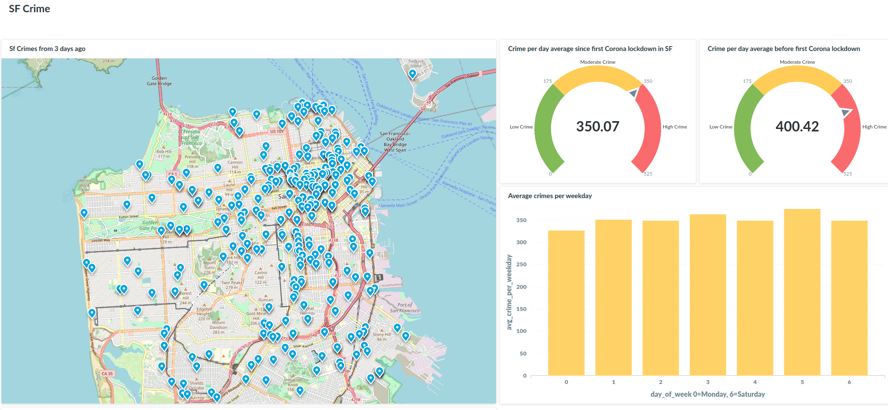

<div id="top"></div>

<h3 align="center">Crime ETL-Dashboard: server set, metabase and postgres installation, AWS Lambda function</h3>

<br />
<div align="center">
  <a href="https://github.com/SamuelAdamsMcGuire/crime_analysis">
    
  </a>


  <p align="center">
    <br />
    <a href="https://github.com/SamuelAdamsMcGuire/crime_analysis"><strong>Explore the docs »</strong></a>
    <br />
    <br />
    <a href="https://github.com/SamuelAdamsMcGuire/crime_analysis">View Demo</a>
    ·
    <a href="https://github.com/SamuelAdamsMcGuire/crime_analysis/issues">Report Bug</a>
    ·
    <a href="https://github.com/SamuelAdamsMcGuire/crime_analysis/issues">Request Feature</a>
  </p>
</div>


<!-- TABLE OF CONTENTS -->
<details>
  <summary>Table of Contents</summary>
  <ol>
    <li>
      <a href="#about-the-project">About The Project</a>
      <ul>
        <li><a href="#built-with">Built With</a></li>
      </ul>
    </li>
    <li>
      <a href="#getting-started">Getting Started</a>
      <ul>
        <li><a href="#prerequisites">Prerequisites</a></li>
        <li><a href="#installation">Installation</a></li>
      </ul>
    </li>
    <li><a href="#usage">Usage</a></li>
    <li><a href="#roadmap">Roadmap</a></li>
    <li><a href="#contributing">Contributing</a></li>
    <li><a href="#license">License</a></li>
    <li><a href="#contact">Contact</a></li>
  </ol>
</details>


<!-- ABOUT THE PROJECT -->
## About The Project

Resulting dashboard: [SF Crime Dashboard](http://34.159.42.59/public/dashboard/f9bea83c-0e41-4c3d-a1a4-a8e430e3e089)

This project involved writing python code to download the current San Francisco crime statistics, do the pre-processing, then upload the dataframe to Postgresql for visualization with Metabase. The Postgres and Metabase servers were made from scratch on the google cloud with both programs being installed from scratch. The database is then updated using an AWS Eventbridge cronjob to trigger an AWS Lambda function which contains the python script in a `lambda_handler` function.   

<p align="right">(<a href="#top">back to top</a>)</p>


### Built With

* [Python](https://www.python.org/)
* [Metabase](https://www.metabase.com/)
* [AWS Eventbridge](https://aws.amazon.com/eventbridge/)
* [AWS Lambda](https://docs.aws.amazon.com/lambda/)
* [Google Cloud](https://cloud.google.com/)


<p align="right">(<a href="#top">back to top</a>)</p>


<!-- GETTING STARTED -->
## Getting Started

The project has 2 servers, one running Postgresql and the other Metabase. First register for google cloud account and/or AWS. I was interested in using both for practice on both platforms.   

### Prerequisites

A google cloud and AWS account and some knowledge of BASH, python, pandas and SQLalchemy.

### Installation

#### Postgres
Connect to server via `ssh`. On this server install postgres. The following commands will be run in the terminal:

```
sudo apt-get update
sudo apt -y install postgresql postgresql-client postgresql-contrib
``` 
Then log in as the superuser and change the password:
```
sudo -u postgres psql postgres
``` 

Now to be able to connect to Postgresql remotely a few things must be adjusted. In terminal, edit pg_hba.conf using the nano editor or your favorite editor.
``` 
sudo nano /etc/postgresql/12/main/pg_hba.conf
```

Scroll down to the bottom of the file and add the following lines:
``` 
# IPv4 remote connections for the tutorial:
host    all             all           [YOUR_IPV4_ADDRESS]/32         md5
``` 
Replace [YOUR_IPV4_ADDRESS] with the address of your local computer.

Now the postgres.conf file must also be edited:
```
sudo nano /etc/postgresql/12/main/postgresql.conf
```
In this file the `listen_addresses` must be altered from localhost to either a specific IP address or to `*` for any:
```
listen_addresses = '*'
``` 
Once these two files have been edited then the firewall must be adjusted in google cloud to open the network port. The details and instuctions can be found [HERE](https://cloud.google.com/vpc/docs/using-firewalls). Or please get in touch for help.

Then connect to Postgresql using `psqp -U username -h ip_address_server -p 5432`. Once connected create a database called `crime`. 

#### Metabase

- connect to second server via ssh. 
- check for updates `sudo apt-get update -y`
- install the updates `sudo apt-get upgrade -y`
- install java `sudo apt-get install -y openjdk-11-jre-headless`
- download the metabase installer `wget https://downloads.metabase.com/v0.36.3/metabase.jar`
- start metabase server in the background `sudo nohup java -jar -DMB_JETTY_PORT=80 metabase.jar &`

> You should now be able to visit your metabase by typing in the hostname/ip of your e2-server in your browser. Please register and then add the database that was created on the Postgresql server.

                
<p align="right">(<a href="#top">back to top</a>)</p>


<!-- USAGE EXAMPLES -->
## Usage

One the backend servers are set up the data flow need to be set up. Data will come from the Sna Francisco open data website, be processed using an `AWS Lambda` function written in pandas and then pushed to the `postgresql` server using `SQLalchemy`. If the Metabase server is configured correctly and connected to the `crime` database then the data will automatically appear there where SQL queries can be used to visualize different results.

<!-- to do:_For more examples, please refer to the [Documentation](https://example.com)_-->

<p align="right">(<a href="#top">back to top</a>)</p>


<!-- ROADMAP -->
## Roadmap

#### Lambda Function:
1. Wrap the python data extraction and cleaning code into a `lambda_handler`, see the crime.py file here for the code. Keep in mind that the DB connection string must be from the postgresql server that was made, the current connection string is only a placeholder. 
[lambda](images/lambda_func.png)
2. Use built-in aws data wrangling layer for access to pandas.
3. Make custom layer for sqlalchemy and psycopg2:
    - create a folder named `python`
    - pip install the needed libraries into that folder using target argument:
    - `pip install aws-psycopg2 sqlalchemy -t python/`
    - zip the contents of the `python`folder:
    - ` zip -r sql_lambda.zip python/`
4. Upload the zip file to aws lamba layers
5. Add custom layer to funtion
[layer](images/layers.png)
6. Run test of lambda function 


#### Set up Lambda function to run automatically every day at 4:05 am

1. Once the lambda function has been tested and it works go to AWS EventBridge
2. Create a rule using the `cron expression` option with the input `5 4 * * ? *`
3. Select your target as the lambda function that was made and create the rule. 
4. Now the lambda function should be executed daily at 4:05 am

Now on Metabase explore the data with different SQL queries and use Metabase to make visualizations with them. Here is one example query:
```sql
SELECT COUNT(*)/COUNT(DISTINCT(date)) AS crimes, 
DATE_PART('hour', datetime) AS hour_of_day 
FROM sf_crime 
GROUP BY hour_of_day;
``` 

See the [open issues](https://github.com/SamuelAdamsMcGuire/crime_analysis/issues) for a full list of proposed features (and known issues).

<p align="right">(<a href="#top">back to top</a>)</p>


<!-- CONTRIBUTING -->
## Contributing

Contributions are what make the open source community such an amazing place to learn, inspire, and create. Any contributions you make are **greatly appreciated**.

If you have a suggestion that would make this better, please fork the repo and create a pull request. You can also simply open an issue with the tag "enhancement".
Don't forget to give the project a star! Thanks again!

1. Fork the Project
2. Create your Feature Branch (`git checkout -b feature/AmazingFeature`)
3. Commit your Changes (`git commit -m 'Add some AmazingFeature'`)
4. Push to the Branch (`git push origin feature/AmazingFeature`)
5. Open a Pull Request

<p align="right">(<a href="#top">back to top</a>)</p>


<!-- LICENSE -->
## License

Distributed under the MIT License. See `LICENSE` for more information.

<p align="right">(<a href="#top">back to top</a>)</p>


<!-- CONTACT -->
## Contact

Samuel Adams McGuire - samuelmcguire@engineer.com

Data Source: [DataSF](https://data.sfgov.org/Public-Safety/Police-Department-Incident-Reports-2018-to-Present/wg3w-h783)


Linkedin: [LinkedIn](https://www.linkedin.com/in/samuel-mcguire/)

Project Link: [https://github.com/SamuelAdamsMcGuire/crime_analysis](https://github.com/SamuelAdamsMcGuire/crime_analysis)

<p align="right">(<a href="#top">back to top</a>)</p>